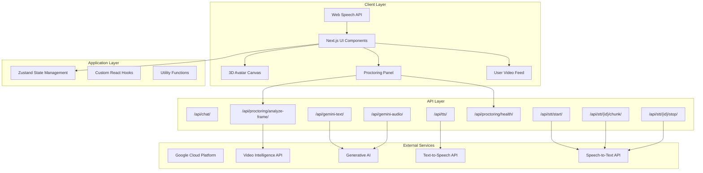
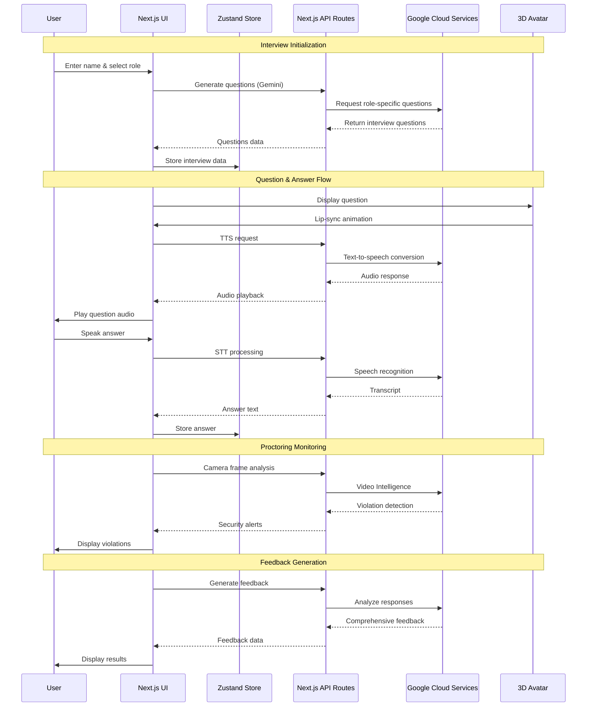
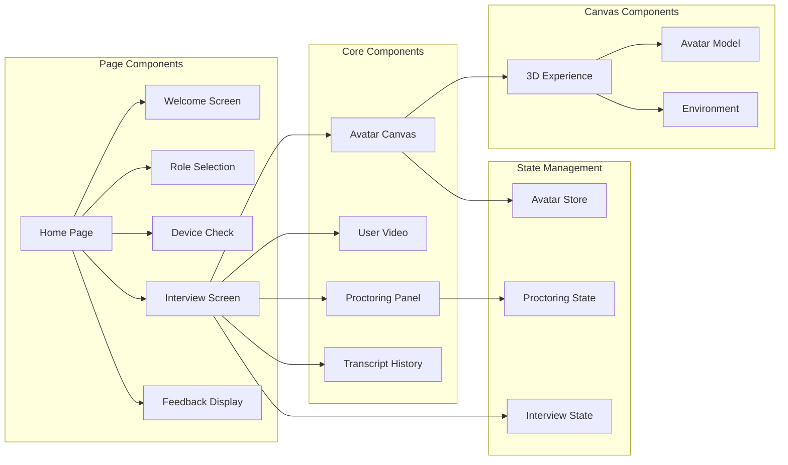

# AI Interview Assistant with Real-Time Proctoring

A professional AI-powered interview platform featuring a 3D avatar interviewer, real-time speech recognition and synthesis, intelligent question management, and secure, real-time camera and audio proctoring powered by Google Cloud Video Intelligence.

## 🚀 Live Demo

- **Production Demo**: [https://intervu-assist.vercel.app](https://intervu-assist.vercel.app)

## 📋 Table of Contents

- [Overview](#overview)
- [Features](#features)
- [Architecture](#architecture)
- [Technology Stack](#technology-stack)
- [Project Structure](#project-structure)
- [Installation & Setup](#installation--setup)
- [Environment Configuration](#environment-configuration)
- [Google Cloud Setup](#google-cloud-setup)
- [Usage Guide](#usage-guide)
- [API Documentation](#api-documentation)
- [Development](#development)
- [Deployment](#deployment)
- [Troubleshooting](#troubleshooting)
- [Contributing](#contributing)
- [License](#license)

## 🎯 Overview

The AI Interview Assistant is a comprehensive interview platform that combines cutting-edge AI technologies to create an immersive and secure interview experience. The system features:

- **3D Avatar Interviewer**: Realistic 3D avatar with lip-sync and facial animations
- **AI-Powered Question Generation**: Dynamic question generation based on role requirements
- **Real-Time Speech Processing**: Web Speech API for STT and Google TTS for synthesis
- **Advanced Proctoring**: Real-time audio monitoring with violation detection
- **Intelligent Feedback**: AI-generated comprehensive interview feedback and scoring

## ✨ Features

### Core Features
- 🎭 **3D Avatar with Lip-Sync**: Realistic interviewer avatar with synchronized speech animations
- 🎤 **Real-Time Speech Recognition**: Web Speech API for instant transcription
- 🔊 **Text-to-Speech Synthesis**: Google Cloud TTS with natural voice output
- 🤖 **AI Question Generation**: Role-specific interview questions using Gemini AI
- 📊 **Intelligent Feedback System**: Comprehensive analysis and scoring
- 📱 **Responsive Design**: Works seamlessly across desktop and mobile devices

### Proctoring Features
- 🎵 **Audio Level Monitoring**: Background noise detection and analysis
- ⚠️ **Violation Detection**: Security violation alerts with severity levels
- 📈 **Adaptive Analysis**: Smart backoff algorithms to optimize API usage
- 🔒 **Privacy-First**: Client-side processing with secure API communication

### User Experience
- 🎯 **Multi-Role Support**: Python Developer, Data Scientist, AI/ML Engineer, Full Stack Developer
- 📝 **Transcript Export**: Export interview transcripts in TXT and JSON formats
- 📄 **PDF Report Generation**: Download comprehensive feedback reports
- 🎮 **Interactive Controls**: Start/stop recording with visual feedback
- 📊 **Real-Time Status**: Live monitoring of interview progress and system status

## 🏗️ Architecture

### System Architecture


### Data Flow Architecture


### Component Architecture


## 🛠️ Technology Stack

### Frontend
- **Framework**: Next.js 15.5.0 (React 19.1.0)
- **3D Graphics**: React Three Fiber + Three.js
- **State Management**: Zustand
- **Styling**: Tailwind CSS
- **TypeScript**: Full type safety

### Backend
- **Runtime**: Node.js 18.17.0+
- **API Routes**: Next.js API Routes
- **Authentication**: Environment-based configuration

### AI & Cloud Services
- **Google AI Studio**: Gemini Pro for question generation and feedback
- **Google Cloud TTS**: Text-to-speech synthesis
- **Google Cloud Video Intelligence**: Real-time proctoring
- **Web Speech API**: Client-side speech recognition


## 📁 Project Structure

```
ai-interview/
├── 📁 public/                    # Static assets
│   ├── avatar.glb               # 3D avatar model
│   ├── office-background.jpg    # Background image
│   ├── OggOpusEncoder.wasm     # Audio encoder
│   └── silero_vad.onnx         # Voice activity detection
├── 📁 src/
│   ├── 📁 app/                  # Next.js App Router
│   │   ├── 📁 api/              # API routes
│   │   │   ├── 📁 chat/         # Chat functionality
│   │   │   ├── 📁 gemini-audio/ # Audio processing
│   │   │   ├── 📁 gemini-text/  # Text processing
│   │   │   ├── 📁 proctoring/   # Proctoring services
│   │   │   ├── 📁 stt/          # Speech-to-text
│   │   │   └── 📁 tts/          # Text-to-speech
│   │   ├── globals.css          # Global styles
│   │   ├── layout.tsx           # Root layout
│   │   └── page.tsx             # Main application
│   ├── 📁 components/           # React components
│   │   ├── 📁 canvas/           # 3D avatar components
│   │   ├── ProctoringPanel.tsx  # Proctoring interface
│   │   └── UserVideo.tsx        # User video component
│   ├── 📁 hooks/                # Custom React hooks
│   │   ├── useProctoring.ts     # Proctoring logic
│   │   ├── useUserMedia.ts      # Media handling
│   │   └── useWebSpeechStt.ts   # Speech recognition
│   ├── 📁 lib/                  # Utility libraries
│   │   ├── lipsync.ts           # Lip-sync generation
│   │   └── unifiedSttSession.ts # STT session management
│   └── 📁 store/                # State management
│       └── avatarStore.ts       # Avatar state store
├── 📄 package.json              # Dependencies and scripts
├── 📄 tsconfig.json             # TypeScript configuration
├── 📄 next.config.ts            # Next.js configuration
├── 📄 eslint.config.mjs         # ESLint configuration
├── 📄 env.example               # Environment template
└── 📄 README.md                 # This file
```

## 🚀 Installation & Setup

### Prerequisites
- Node.js 18.17.0 or higher
- npm 9.0.0 or higher
- Google Cloud Platform account
- Google AI Studio API key

### Quick Start
```bash
# 1. Clone the repository
git clone https://github.com/yourusername/ai-interview.git
cd ai-interview

# 2. Install dependencies
npm install

# 3. Set up environment variables
cp env.example .env.local
# Edit .env.local with your API keys

# 4. Start development server
npm run dev

# 5. Open in browser
# http://localhost:3000
```

### Available Scripts
```bash
npm run dev          # Start development server
npm run build        # Build for production
npm run start        # Start production server
npm run lint         # Run ESLint
npm run lint:fix     # Fix ESLint issues
npm run type-check   # Run TypeScript checks
npm run clean        # Clean build artifacts
npm run format       # Format code with Prettier
```

## ⚙️ Environment Configuration

Create a `.env.local` file with the following variables:

```bash
# =============================================================================
# APPLICATION CONFIGURATION
# =============================================================================
NODE_ENV=development
NEXT_PUBLIC_APP_NAME="AI Interview Assistant"
NEXT_PUBLIC_APP_VERSION="1.0.0"
NEXT_PUBLIC_DEBUG_MODE=false

# =============================================================================
# GOOGLE CLOUD SERVICES
# =============================================================================
# Google AI Studio (Gemini) - REQUIRED
GOOGLE_AI_API_KEY=your_gemini_api_key_here
GOOGLE_AI_MODEL=gemini-1.5-flash

# Google Cloud Text-to-Speech API - REQUIRED
GOOGLE_TTS_API_KEY=path/to/your/service-account-key.json
GOOGLE_TTS_PROJECT_ID=your-project-id
GOOGLE_TTS_VOICE_NAME=en-IN-Standard-A
GOOGLE_TTS_LANGUAGE_CODE=en-IN

# Google Cloud Video Intelligence API - OPTIONAL (for proctoring)
GOOGLE_VIDEO_INTELLIGENCE_PROJECT_ID=your-gcp-project-id
GOOGLE_VIDEO_INTELLIGENCE_CREDENTIALS_B64=base64_of_service_account_json
GOOGLE_VIDEO_INTELLIGENCE_LOCATION=us-central1

# =============================================================================
# SPEECH-TO-TEXT CONFIGURATION
# =============================================================================
STT_BACKEND=webspeech
STT_LANGUAGE=en-US
STT_CONTINUOUS=true
STT_INTERIM_RESULTS=true

# =============================================================================
# SECURITY & RATE LIMITING
# =============================================================================
API_RATE_LIMIT_WINDOW_MS=900000
API_RATE_LIMIT_MAX_REQUESTS=100
CORS_ORIGIN=http://localhost:3000
SESSION_SECRET=your-super-secret-session-key-here
```

## ☁️ Google Cloud Setup

### 1. Google AI Studio (Gemini)
1. Visit [Google AI Studio](https://makersuite.google.com/app/apikey)
2. Create a new API key
3. Add to `.env.local` as `GOOGLE_AI_API_KEY`

### 2. Google Cloud Text-to-Speech
1. Enable [Text-to-Speech API](https://console.cloud.google.com/apis/library/texttospeech.googleapis.com)
2. Create a service account with "Cloud Text-to-Speech User" role
3. Download JSON key file
4. Add path to `.env.local` as `GOOGLE_TTS_API_KEY`

### 3. Google Cloud Video Intelligence (Optional)
1. Enable [Video Intelligence API](https://console.cloud.google.com/apis/library/videointelligence.googleapis.com)
2. Create service account with "Video Intelligence API User" role
3. Download JSON key file
4. For Vercel deployment, convert to base64:
   ```bash
   cat service-account.json | base64 -w 0
   ```
5. Add to `.env.local` as `GOOGLE_VIDEO_INTELLIGENCE_CREDENTIALS_B64`

### Health Check
Verify configuration:
```bash
curl http://localhost:3000/api/proctoring/health
# Should return: {"gcp":{"configured":true}}
```

## 📖 Usage Guide

### 1. Welcome Screen
- Enter your name to begin
- System will guide you through the setup process

### 2. Role Selection
Choose from available roles:
- **Python Developer**: Backend development focus
- **Data Scientist**: Data analysis and ML focus
- **AI/ML Engineer**: Machine learning and AI focus
- **Full Stack Developer**: Full-stack development focus

### 3. Device Check
- **Camera Test**: Verify camera access and positioning
- **Microphone Test**: Speak "hello" to test audio levels
- **Proctoring Status**: Monitor system readiness

### 4. Interview Process
- **Question Display**: 3D avatar presents questions with lip-sync
- **Answer Recording**: Use Start/Stop button to control recording
- **Real-Time Transcription**: See your answers transcribed instantly
- **Proctoring Alerts**: Monitor for security violations

### 5. Feedback & Results
- **AI Analysis**: Comprehensive feedback generation
- **Score Assessment**: Overall performance scoring
- **Export Options**: Download transcript and PDF reports

## 🛠️ Development
### Code Structure

#### State Management
The application uses Zustand for state management with three main stores:

1. **Avatar Store** (`src/store/avatarStore.ts`)
   - Manages 3D avatar animations and lip-sync
   - Controls audio playback and viseme timing
   - Handles avatar state transitions

2. **Interview State** (Component-level)
   - Manages interview flow and question progression
   - Handles user responses and transcript storage
   - Controls interview session lifecycle

3. **Proctoring State** (`src/hooks/useProctoring.ts`)
   - Manages real-time monitoring
   - Tracks security violations
   - Handles camera and audio analysis

#### Custom Hooks

1. **useProctoring** (`src/hooks/useProctoring.ts`)
   - Real-time camera and audio monitoring
   - Violation detection and reporting
   - Adaptive analysis scheduling

2. **useWebSpeechStt** (`src/hooks/useWebSpeechStt.ts`)
   - Web Speech API integration
   - Real-time transcription
   - Audio level monitoring

3. **useUserMedia** (`src/hooks/useUserMedia.ts`)
   - Camera and microphone access
   - Stream management
   - Device capability detection

### 3D Avatar System

#### Avatar Model
- **Format**: GLB (GL Binary)
- **Location**: `public/avatar.glb`
- **Features**: Morph targets, bone animations, lip-sync

#### Animation System
```typescript
// Lip-sync generation
const visemes = generateVisemes(text);

// Avatar state management
const playAudioWithVisemes = useAvatarStore(state => state.playAudioWithVisemes);
playAudioWithVisemes(audioBlob, visemes, callback);
```

#### Rendering Pipeline
1. **Scene Setup**: Three.js scene with lighting and environment
2. **Model Loading**: GLB model with morph targets and bones
3. **Animation Loop**: Real-time viseme and bone updates
4. **Audio Sync**: Synchronized audio playback with animations

### Proctoring System

#### Audio Monitoring
- **Real-time**: Continuous audio level monitoring
- **Analysis**: Background noise detection
- **Thresholds**: Configurable sensitivity levels

#### Violation Detection
```typescript
interface SecurityViolation {
  id: string;
  type: 'camera' | 'audio';
  severity: 'low' | 'medium' | 'high';
  description: string;
  timestamp: Date;
  details?: any;
}
```

## 🚀 Deployment

### Vercel Deployment 

1. **Connect Repository**
   ```bash
   vercel --prod
   ```

2. **Environment Variables**
   - Set all required environment variables in Vercel dashboard
   - Use base64 encoding for service account JSON files

3. **Build Configuration**
   ```json
   {
     "buildCommand": "npm run build",
     "outputDirectory": ".next",
     "installCommand": "npm install"
   }
   ```

### Environment-Specific Configurations

#### Development
```bash
NEXT_PUBLIC_DEBUG_MODE=true
NEXT_PUBLIC_MOCK_API=false
LOG_LEVEL=debug
```

#### Production
```bash
NEXT_PUBLIC_DEBUG_MODE=false
NEXT_PUBLIC_MOCK_API=false
LOG_LEVEL=warn
NODE_ENV=production
```

### Performance Monitoring

#### Browser DevTools
- **Performance Tab**: Monitor rendering performance
- **Network Tab**: Check API request timing
- **Console**: View debug logs and errors

#### API Monitoring
- **Response Times**: Monitor API endpoint performance
- **Error Rates**: Track API error frequencies
- **Rate Limiting**: Monitor API quota usage

## 🤝 Contributing

### Development Workflow

1. **Fork Repository**
   ```bash
   git clone https://github.com/yourusername/ai-interview.git
   cd ai-interview
   ```

2. **Create Feature Branch**
   ```bash
   git checkout -b feature/your-feature-name
   ```

3. **Make Changes**
   - Follow TypeScript best practices
   - Add proper error handling
   - Include unit tests for new features

4. **Test Changes**
   ```bash
   npm run lint
   npm run type-check
   npm run build
   ```

5. **Submit Pull Request**
   - Include detailed description
   - Add screenshots for UI changes
   - Reference related issues

### Code Standards

#### TypeScript
- Use strict type checking
- Avoid `any` types
- Use interfaces for object shapes

#### React
- Use functional components with hooks
- Implement proper cleanup in useEffect
- Follow React best practices

#### Styling
- Use Tailwind CSS classes
- Maintain responsive design
- Follow accessibility guidelines

### Testing

#### Unit Tests
```bash
npm run test
```

#### Integration Tests
```bash
npm run test:integration
```

#### E2E Tests
```bash
npm run test:e2e
```
## Meet the team

1. **Aryan Paratakke**:
   - **GitHub**: [Aryan Paratakke GitHub](https://github.com/Aryan152005/)
   - **LinkedIn**: [Aryan Paratakke LinkedIn](https://in.linkedin.com/in/aryan-paratakke-43b879276)

2. **Arya Hotey**:
   - **GitHub**: [Arya Hotey GitHub](https://github.com/Arya202004)
   - **LinkedIn**: [Arya Hotey LinkedIn](https://in.linkedin.com/in/arya-hotey-aab5b32a7)


## 📄 License

This project is licensed under the MIT License - see the [LICENSE](LICENSE) file for details.


---

