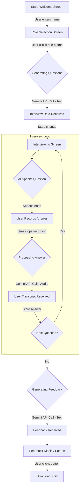

# AI Interview Assistant

**A real-time, 3D avatar-based interview platform powered by generative AI.**

This project is a web-based application that simulates a professional job interview with an interactive 3D avatar. The avatar, acting as an AI HR manager, greets the user, generates role-specific questions, listens to the user's spoken answers, and provides comprehensive feedback at the end of the session.


---

## ✨ Features

- **Interactive 3D Avatar:** A realistic 3D avatar rendered in real-time using Three.js and React Three Fiber.
- **Dynamic User Flow:** A multi-step process that starts with a personalized greeting and role selection.
- **AI-Powered Question Generation:** Utilizes the Google Gemini API to generate a unique set of 10 interview questions based on the user's selected job role.
- **Voice-to-Text Transcription:** Captures the user's spoken answers using a robust audio recorder and transcribes them via the Gemini API.
- **Text-to-Speech (TTS):** The AI avatar speaks its questions and greetings using the browser's built-in Speech Synthesis API.
- **Comprehensive Feedback:** After the interview, the Gemini API analyzes all questions, expected answers, and the user's actual answers to generate a detailed performance report.
- **PDF Report Download:** Users can download their final feedback report as a PDF for review.

---

## 🚀 Application Workflow

The application follows a structured, state-driven workflow from start to finish, ensuring a smooth and logical user experience.



-----

## 🛠️ Technology Stack

This project is built with a modern, professional tech stack designed for real-time, AI-driven web applications.

| Category              | Technology / Library                                                              | Purpose                                                                                   |
| --------------------- | --------------------------------------------------------------------------------- | ----------------------------------------------------------------------------------------- |
| **Framework** | [Next.js](https://nextjs.org/) (React)                                            | Full-stack web application framework with serverless functions.                           |
| **Generative AI** | [Google Gemini API](https://ai.google.dev/)                                       | Question generation, audio transcription, and final feedback analysis.                    |
| **3D Rendering** | [Three.js](https://threejs.org/), [@react-three/fiber](https://docs.pmnd.rs/react-three-fiber), [@react-three/drei](https://github.com/pmndrs/drei) | Rendering and interacting with the 3D avatar model.                                       |
| **Audio Capture** | [opus-media-recorder](https://www.npmjs.com/package/opus-media-recorder)            | Robust, client-side audio recording to create clean `.wav` files.                         |
| **Text-to-Speech** | Browser [SpeechSynthesis API](https://developer.mozilla.org/en-US/docs/Web/API/SpeechSynthesis) | Vocalizing the AI avatar's questions and greetings.                                       |
| **PDF Generation** | [jsPDF](https://github.com/parallax/jsPDF), [html2canvas](https://html2canvas.hertzen.com/) | Generating a downloadable PDF of the final feedback report.                               |
| **Styling** | [Tailwind CSS](https://tailwindcss.com/) (via CDN)                                | Utility-first CSS framework for rapid UI development.                                     |
| **Deployment** | [Vercel](https://vercel.com/)                                                     | Hosting and serverless infrastructure for the Next.js application.                        |

-----

## 📂 Directory Structure

The project follows the standard Next.js App Router structure, with clear separation for components, hooks, and API routes.

```
my-avatar-assistant/
├── public/
│   ├── avatar.glb                # 3D model for the avatar
│   ├── office-background.jpg     # Texture for the 3D scene
│   ├── encoderWorker.umd.js      # Opus Media Recorder files
│   ├── OggOpusEncoder.wasm       #
│   └── WebMOpusEncoder.wasm      #
├── src/
│   ├── app/
│   │   ├── api/
│   │   │   ├── gemini-audio/
│   │   │   │   └── route.ts      # Backend for audio transcription
│   │   │   └── gemini-text/
│   │   │       └── route.ts      # Backend for question/feedback generation
│   │   ├── layout.tsx            # Root application layout
│   │   └── page.tsx              # Main page component with all UI and logic
│   ├── components/
│   │   ├── canvas/
│   │   │   └── AvatarCanvas.tsx  # Renders the 3D avatar scene
│   │   └── UserVideo.tsx         # Displays the user's webcam feed
│   └── hooks/
│       └── useAudioRecorder.ts   # Manages client-side audio recording
├── .env.local                    # Environment variables (API keys)
├── next.config.mjs               # Next.js configuration
└── package.json                  # Project dependencies
```

-----

## ⚙️ Setup and Installation

Follow these steps to get the project running on your local machine.

### **Prerequisites**

  - [Node.js](https://nodejs.org/) (v18 or later)
  - [npm](https://www.npmjs.com/) (or yarn/pnpm)

### **1. Clone the Repository**

```bash
git clone [https://github.com/Aryan152005/ai-interview.git](https://github.com/Aryan152005/ai-interview.git)
cd ai-interview
```

### **2. Install Dependencies**

```bash
npm install
```

### **3. Set Up Environment Variables**

Create a file named `.env.local` in the root of your project and add your API keys.

```env
# .env.local
GEMINI_API_KEY=YOUR_GOOGLE_GEMINI_API_KEY
```

### **4. Copy Audio Recorder Assets**

The `opus-media-recorder` library requires specific worker files to be publicly accessible.

1.  Navigate to `node_modules/opus-media-recorder/`.
2.  Copy `encoderWorker.umd.js`, `OggOpusEncoder.wasm`, and `WebMOpusEncoder.wasm`.
3.  Paste these three files into the `/public` directory of your project.

-----

## ▶️ How to Run

Start the development server with the following command:

```bash
npm run dev
```

Open your browser and navigate to `http://localhost:3000`. The application should now be running.


