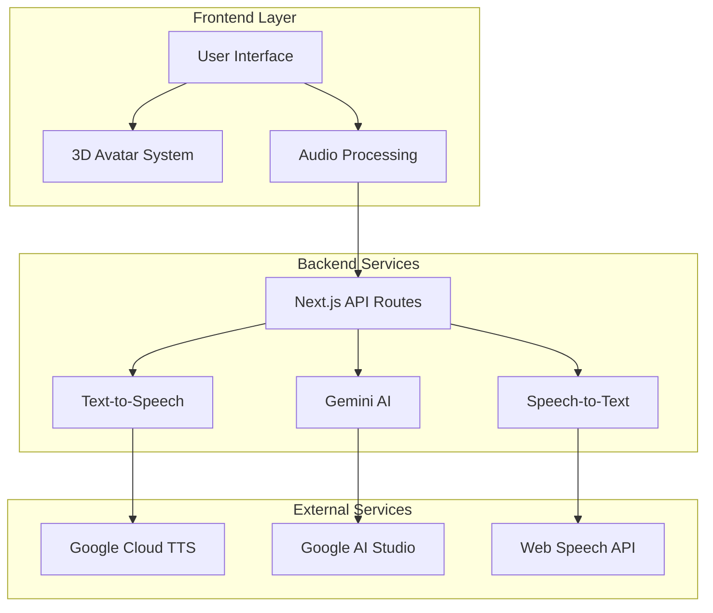
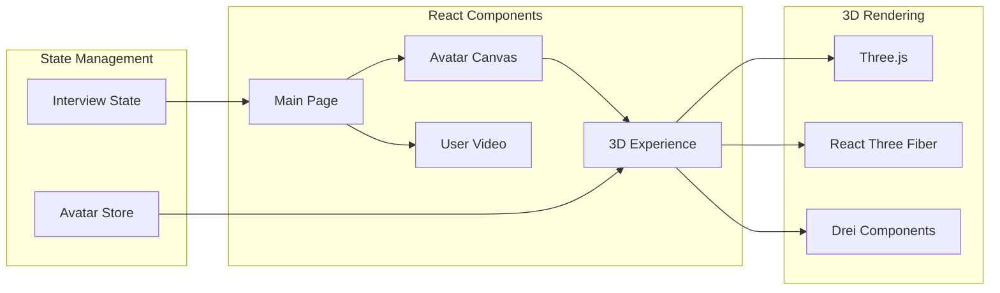
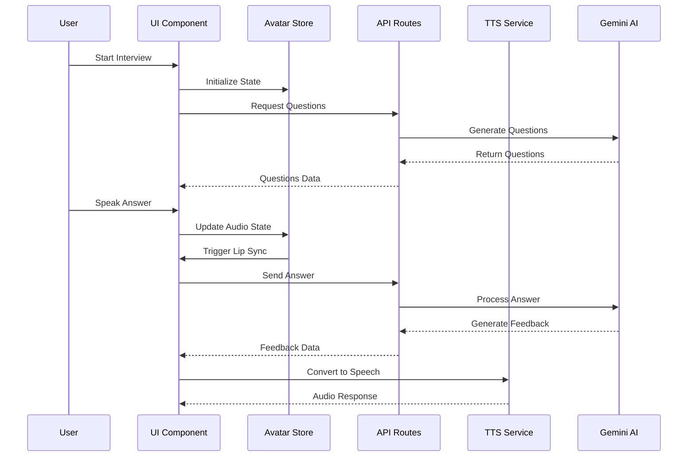

# AI Interview Assistant 🎯

A professional AI-powered interview application featuring real-time 3D avatar interactions, speech-to-text transcription, and intelligent question management. Built with Next.js 15, React Three Fiber, and Google AI services.

## 🚀 Features

### Core Capabilities
- **3D Avatar Interviewer**: Lifelike 3D avatar with real-time lip-sync and facial animations
- **Real-time Speech Recognition**: Web Speech API for instant transcription
- **Intelligent Question Flow**: Dynamic interview progression with role-based questions
- **Professional UI**: Clean, responsive interface with transcript history
- **Export Capabilities**: Download interview transcripts in TXT/JSON formats
- **Device Testing**: Built-in microphone and camera validation

### Advanced Features
- **Enhanced Lip Sync**: Amplified mouth movements for better visibility
- **Realistic Blinking**: Procedural eye blinking using bone-based animation
- **Natural Head Movement**: Subtle head and neck movements during speech
- **Eye Tracking**: Realistic eye movement and gaze following
- **Morph Target Support**: Facial expression animation using shape keys
- **Bone Animation**: Skeletal animation for realistic human movement

## 🏗️ System Architecture

### High-Level Architecture


### Component Architecture


### Data Flow


## 📁 Project Structure

```
ai-interview/
├── 📁 public/                    # Static assets
│   ├── 🎭 avatar.glb            # 3D avatar model
│   ├── 🖼️ office-background.jpg # Background image
│   ├── 🔊 OggOpusEncoder.wasm   # Audio encoder
│   └── 🧠 silero_vad.onnx      # Voice activity detection
├── 📁 src/                      # Source code
│   ├── 📁 app/                  # Next.js app router
│   │   ├── 📁 api/              # API endpoints
│   │   │   ├── 💬 chat/         # Gemini chat integration
│   │   │   ├── 🎵 gemini-audio/ # Audio transcription
│   │   │   ├── 📝 gemini-text/  # Text-based AI responses
│   │   │   ├── ❤️ health/       # Service health checks
│   │   │   ├── 🗣️ stt/          # Speech-to-text endpoints
│   │   │   └── 🔊 tts/          # Text-to-speech endpoints
│   │   ├── 🎨 globals.css      # Global styles
│   │   ├── 🏗️ layout.tsx       # Root layout
│   │   └── 🏠 page.tsx         # Main interview interface
│   ├── 📁 components/           # React components
│   │   ├── 📁 canvas/           # 3D rendering components
│   │   │   ├── 🎭 AvatarCanvas.tsx # Avatar wrapper
│   │   │   └── 🌟 Experience.tsx   # 3D scene setup
│   │   └── 📹 UserVideo.tsx     # Camera feed component
│   ├── 📁 hooks/                # Custom React hooks
│   │   └── 🎤 useWebSpeechStt.ts    # Web Speech API hook
│   ├── 📁 lib/                  # Utility libraries
│   │   ├── 💋 lipsync.ts            # Viseme generation
│   │   └── 🔄 unifiedSttSession.ts  # STT session management
│   ├── 📁 store/                # State management
│   │   └── 🎭 avatarStore.ts        # Avatar state and audio
│   └── 📁 types/                # TypeScript definitions
├── 📄 package.json              # Dependencies and scripts
├── 📄 next.config.ts            # Next.js configuration
├── 📄 tsconfig.json             # TypeScript configuration
├── 📄 eslint.config.mjs         # ESLint configuration
└── 📄 README.md                 # This file
```

## 🛠️ Setup & Installation

### Prerequisites

- **Node.js**: Version 18.17.0 or higher
- **npm**: Version 9.0.0 or higher (or yarn)
- **Google Cloud Platform**: Account with billing enabled
- **Google AI Studio**: Account for Gemini AI access
- **Modern Browser**: Chrome 90+, Firefox 88+, Safari 14+, Edge 90+

### System Requirements

- **RAM**: Minimum 4GB, Recommended 8GB+
- **Storage**: 2GB available space
- **Graphics**: WebGL 2.0 support
- **Network**: Stable internet connection for AI services

### 1. Clone Repository

```bash
# Clone the repository
git clone https://github.com/yourusername/ai-interview.git

# Navigate to project directory
cd ai-interview

# Install dependencies
npm install
```

### 2. Environment Configuration

Create `.env.local` file in the root directory:

```env
# Google Cloud Text-to-Speech
GOOGLE_TTS_API_KEY=your_google_tts_api_key_here
GOOGLE_TTS_PROJECT_ID=your_project_id_here

# Google AI Studio (Gemini)
GOOGLE_AI_API_KEY=your_gemini_api_key_here

# STT Configuration
STT_BACKEND=webspeech

# Optional: Development overrides
NODE_ENV=development
NEXT_PUBLIC_DEBUG_MODE=true
```

### 3. Google Cloud Setup

#### Text-to-Speech API Setup

1. **Enable API**:
   - Go to [Google Cloud Console](https://console.cloud.google.com/)
   - Select your project or create a new one
   - Navigate to "APIs & Services" > "Library"
   - Search for "Cloud Text-to-Speech API"
   - Click "Enable"

2. **Create Service Account**:
   - Go to "IAM & Admin" > "Service Accounts"
   - Click "Create Service Account"
   - Name: `ai-interview-tts`
   - Description: `Service account for AI Interview TTS`
   - Click "Create and Continue"

3. **Assign Roles**:
   - Role: `Cloud Text-to-Speech User`
   - Click "Continue" and "Done"

4. **Generate API Key**:
   - Click on the service account
   - Go to "Keys" tab
   - Click "Add Key" > "Create new key"
   - Choose "JSON" format
   - Download the key file

5. **Set Environment Variables**:
   ```env
   GOOGLE_TTS_API_KEY=path/to/your/service-account-key.json
   GOOGLE_TTS_PROJECT_ID=your-project-id
   ```

#### Gemini AI Setup

1. **Get API Key**:
   - Visit [Google AI Studio](https://aistudio.google.com/)
   - Sign in with your Google account
   - Click "Get API key"
   - Create a new API key or use existing one

2. **Set Environment Variable**:
   ```env
   GOOGLE_AI_API_KEY=your_gemini_api_key_here
   ```

### 4. Development Server

```bash
# Start development server
npm run dev

# The application will be available at:
# http://localhost:3000
```

### 5. Build for Production

```bash
# Build the application
npm run build

# Start production server
npm start

# Or use a process manager like PM2
npm install -g pm2
pm2 start npm --name "ai-interview" -- start
```

## 🎮 Usage Guide

### Starting an Interview

1. **Access the Application**:
   - Open your browser and navigate to the application URL
   - Allow microphone and camera permissions when prompted

2. **Select Interview Type**:
   - Choose from available interview categories
   - Select difficulty level (Beginner, Intermediate, Advanced)

3. **Begin Interview**:
   - Click "Start Interview" button
   - The 3D avatar will greet you and ask the first question

### During the Interview

1. **Answer Questions**:
   - Speak clearly into your microphone
   - Your speech will be transcribed in real-time
   - The avatar will respond with lip-sync animation

2. **View Progress**:
   - Monitor your interview progress
   - Review transcript history
   - See real-time feedback

3. **End Interview**:
   - Click "End Interview" when finished
   - Export transcript if desired

### Avatar Controls

- **F12 Key**: Toggle debug overlay (development mode)
- **Console Logs**: View GLB structure analysis
- **Real-time Animation**: Automatic lip-sync and blinking

## 🔧 Configuration Options

### Avatar Animation Settings

```typescript
// Enhanced animation parameters
const animationConfig = {
  lipSync: {
    amplification: 1.8,        // Mouth opening amplification
    jawAmplification: 1.5,     // Jaw movement amplification
    smileAmplification: 1.4,   // Smile expression amplification
    responseSpeed: 0.4         // Animation response speed
  },
  blinking: {
    frequency: { min: 2.5, max: 5.5 }, // Blink frequency in seconds
    duration: 0.12,                     // Blink duration in seconds
    rotationAmplification: 0.8          // Eye rotation amplification
  },
  eyeMovement: {
    wanderAmplitude: 0.04,     // Eye movement amplitude
    headFollowRatio: 0.3       // Head following eye movement
  }
};
```

### Audio Processing Settings

```typescript
// Audio configuration
const audioConfig = {
  sampleRate: 16000,
  channels: 1,
  bitDepth: 16,
  silenceThreshold: 0.01,
  vadSensitivity: 0.5
};
```

## 🚀 Production Deployment

### Environment Variables (Production)

```env
# Production environment
NODE_ENV=production
NEXT_PUBLIC_DEBUG_MODE=false

# Google Cloud (use service account key file path)
GOOGLE_TTS_API_KEY=/path/to/production/service-account.json
GOOGLE_TTS_PROJECT_ID=your-production-project-id

# Gemini AI
GOOGLE_AI_API_KEY=your_production_gemini_key

# Security
NEXT_PUBLIC_API_URL=https://your-domain.com/api
```

### Deployment Options

#### 1. Vercel (Recommended)

```bash
# Install Vercel CLI
npm i -g vercel

# Deploy
vercel --prod
```

#### 2. Docker Deployment

```dockerfile
# Dockerfile
FROM node:18-alpine

WORKDIR /app

COPY package*.json ./
RUN npm ci --only=production

COPY . .
RUN npm run build

EXPOSE 3000

CMD ["npm", "start"]
```

```bash
# Build and run
docker build -t ai-interview .
docker run -p 3000:3000 ai-interview
```

#### 3. Traditional Server

```bash
# Build the application
npm run build

# Install PM2 for process management
npm install -g pm2

# Start the application
pm2 start npm --name "ai-interview" -- start

# Save PM2 configuration
pm2 save

# Setup PM2 to start on boot
pm2 startup
```

### Performance Optimization

1. **Image Optimization**:
   - Use WebP format for images
   - Implement lazy loading
   - Optimize 3D model file size

2. **Code Splitting**:
   - Dynamic imports for heavy components
   - Route-based code splitting
   - Lazy load 3D components

3. **Caching Strategy**:
   - Implement service worker for offline support
   - Cache static assets
   - Use CDN for global distribution

## 🧪 Testing

### Run Tests

```bash
# Run all tests
npm test

# Run tests in watch mode
npm run test:watch

# Run tests with coverage
npm run test:coverage

# Run E2E tests
npm run test:e2e
```

### Manual Testing Checklist

- [ ] **3D Avatar Loading**: Avatar loads without errors
- [ ] **Lip Sync**: Mouth movements sync with audio
- [ ] **Blinking**: Eyes blink naturally
- [ ] **Speech Recognition**: STT works accurately
- [ ] **Question Generation**: AI generates relevant questions
- [ ] **Audio Playback**: TTS works correctly
- [ ] **Export Functionality**: Transcripts export properly
- [ ] **Responsive Design**: Works on different screen sizes
- [ ] **Browser Compatibility**: Works across major browsers

## 🐛 Troubleshooting

### Common Issues

#### 1. Avatar Not Loading

```bash
# Check console for errors
# Verify avatar.glb file exists in public folder
# Check WebGL support in browser
```

#### 2. Audio Issues

```bash
# Check microphone permissions
# Verify audio device selection
# Check browser audio settings
```

#### 3. API Errors

```bash
# Verify environment variables
# Check API key validity
# Monitor API quotas and limits
```

#### 4. Performance Issues

```bash
# Check browser performance tab
# Monitor memory usage
# Verify 3D model optimization
```

### Debug Mode

Enable debug mode by setting environment variable:

```env
NEXT_PUBLIC_DEBUG_MODE=true
```

This will show:
- Debug overlay (F12 key)
- Console logging
- Performance metrics
- GLB structure analysis

## 📊 Performance Metrics

### Target Performance

- **First Contentful Paint**: < 2.0s
- **Largest Contentful Paint**: < 3.0s
- **Time to Interactive**: < 4.0s
- **3D Scene Load Time**: < 1.5s
- **Audio Latency**: < 100ms

### Monitoring

```typescript
// Performance monitoring
const performanceMetrics = {
  avatarLoadTime: 0,
  audioLatency: 0,
  renderFPS: 60,
  memoryUsage: 0
};

// Monitor and log metrics
performance.mark('avatar-start');
// ... avatar loading ...
performance.mark('avatar-end');
performance.measure('avatar-load', 'avatar-start', 'avatar-end');
```

## 🔒 Security Considerations

### API Security

- **Rate Limiting**: Implement API rate limiting
- **Input Validation**: Validate all user inputs
- **CORS Configuration**: Restrict cross-origin requests
- **API Key Rotation**: Regular API key rotation

### Data Privacy

- **Audio Processing**: Process audio locally when possible
- **Data Retention**: Implement data retention policies
- **User Consent**: Obtain explicit user consent for data processing
- **GDPR Compliance**: Ensure GDPR compliance for EU users

## 🤝 Contributing

### Development Setup

```bash
# Fork the repository
# Clone your fork
git clone https://github.com/yourusername/ai-interview.git

# Create feature branch
git checkout -b feature/amazing-feature

# Install dependencies
npm install

# Make changes and test
npm run dev
npm test

# Commit changes
git commit -m "Add amazing feature"

# Push to branch
git push origin feature/amazing-feature

# Create Pull Request
```
## 📄 License

This project is licensed under the MIT License - see the [LICENSE](LICENSE) file for details.

## 🙏 Acknowledgments

- **Three.js Community**: For 3D graphics library
- **React Three Fiber**: For React integration
- **Google AI**: For Gemini AI services
- **Web Speech API**: For speech recognition
- **Next.js Team**: For the amazing framework
