# AI Interview Assistant with Real‑Time Proctoring


<<<<<<< HEAD
A professional AI interview platform featuring a 3D avatar interviewer, real‑time speech recognition and synthesis, intelligent question management, and secure, real‑time camera and audio proctoring powered by Google Cloud Video Intelligence.

## Table of Contents
- Overview
- Live Demo (placeholder)
- Architecture
- Features
- Screenshots (placeholders)
- Quick Start
- Environment Variables
- Google Cloud Setup (Video Intelligence)
- Running Locally
- Production (Vercel)
- Proctoring Details
- Troubleshooting
- FAQ
=======
## 🚀 Features
>>>>>>> 312f932c30714df1509deac0129d2c9411eb8945

## Overview
- 3D avatar interviewer (React Three Fiber + Three.js)
- AI question generation and feedback (Gemini)
- Real‑time STT (Web Speech API) and TTS
- Real‑time proctoring (camera and audio), security violations
- Production‑ready Next.js 15 app

## Live Demo
- Placeholder: https://example.com

## Architecture
```mermaid
graph TB
  subgraph Client
    UI[Next.js UI]
    Canvas[AvatarCanvas]
    STT[Web Speech API]
    ProctorPanel[ProctoringPanel]
  end

  subgraph Server (Next API Routes)
    Chat[/api/chat/]
    TTS[/api/tts/]
    GeminiText[/api/gemini-text/]
    ProctorAnalyze[/api/proctoring/analyze-frame/]
    ProctorHealth[/api/proctoring/health/]
  end

  subgraph Google Cloud
    VideoInt[Video Intelligence API]
    Gemini[Generative AI]
  end

  UI --> Canvas
  UI --> ProctorPanel
  STT --> UI
  ProctorPanel --> ProctorAnalyze
  ProctorPanel --> ProctorHealth
  GeminiText --> Gemini
  TTS --> UI
  ProctorAnalyze --> VideoInt
```

### Data Flow (High Level)

```mermaid
sequenceDiagram
  participant U as User
  participant UI as Next.js UI
  participant P as Proctoring Hook
  participant API as Next API
  participant GCP as GCP Video Intelligence

  U->>UI: Allow camera + mic
  UI->>P: Auto‑start monitoring
  P->>API: Upload frame (periodic/backoff)
  API->>GCP: annotateVideo()
  GCP-->>API: annotations
  API-->>P: violations[]
  P-->>UI: render violations
```


## Features
- 3D avatar interviewer with viseme lip‑sync
- AI‑driven question generation and feedback
- Real‑time speech‑to‑text and text‑to‑speech
- Auto‑start proctoring on permission grant
- Adaptive camera frame analysis with backoff
- Audio noise monitoring and violation alerts
- Minimal, production‑ready config

## Screenshots (Placeholders)
- Device Check: https://via.placeholder.com/960x540
- Interview Screen: https://via.placeholder.com/960x540
- Proctoring Panel: https://via.placeholder.com/960x540

## Quick Start
```bash
# 1) Install
npm install

# 2) Copy env and edit
cp env.example .env.local

# 3) Dev server
npm run dev
# Open http://localhost:3000
```

## Environment Variables
Create `.env.local` with at least:
```bash
# App
NODE_ENV=development
NEXT_PUBLIC_APP_NAME="AI Interview Assistant"
NEXT_PUBLIC_APP_VERSION="1.0.0"
NEXT_PUBLIC_DEBUG_MODE=false

# Google AI (Gemini)
GOOGLE_AI_API_KEY=your_gemini_api_key_here
GOOGLE_AI_MODEL=gemini-pro

# Proctoring (Google Cloud Video Intelligence)
# Use ONE of the credential methods below with PROJECT_ID
GOOGLE_VIDEO_INTELLIGENCE_PROJECT_ID=your-gcp-project-id
# Preferred: Base64 of your service account JSON (no newlines)
GOOGLE_VIDEO_INTELLIGENCE_CREDENTIALS_B64=base64_of_json
# OR raw JSON (minified) – server-side only
# GOOGLE_VIDEO_INTELLIGENCE_CREDENTIALS={"type":"service_account",...}
# OR (local only) path to key file
# GOOGLE_VIDEO_INTELLIGENCE_API_KEY=./gcp-service-account.json

# Optional
GOOGLE_VIDEO_INTELLIGENCE_LOCATION=us-central1
```

## Google Cloud Setup (Video Intelligence)
- Enable “Video Intelligence API” in your GCP project.
- Create a Service Account; grant “Video Intelligence API User”.
- Download JSON key.
- For Vercel, convert JSON to base64 and set `GOOGLE_VIDEO_INTELLIGENCE_CREDENTIALS_B64`.
- Health check: `GET /api/proctoring/health` should return `gcp.configured: true`.

## Running Locally
```bash
npm run dev
# Visit http://localhost:3000
```
<<<<<<< HEAD
- On first load, allow camera and microphone.
- Proctoring auto‑starts; violations display in the panel.

## Production (Vercel)
- Set the environment variables in Vercel Project Settings:
  - `GOOGLE_VIDEO_INTELLIGENCE_PROJECT_ID`
  - `GOOGLE_VIDEO_INTELLIGENCE_CREDENTIALS_B64` (recommended)
  - `GOOGLE_AI_API_KEY`
- Build locally to verify:
```bash
npm run build
npm start
```
- Deploy to Vercel (`vercel --prod`) or connect the repo and trigger a build.

### Security Notes
- Credentials are server‑only environment variables. Never expose on client.
- The API reads inline credentials; no key file is required in the repo.

## Proctoring Details
- Auto‑start: begins as soon as permissions are granted.
- Camera analysis: adaptive schedule with exponential backoff on errors (min 3s, max ~20s).
- Tab visibility aware: slows checks when hidden to preserve quota.
- Violations are logged with severity (low/medium/high) and shown in the UI.
=======
## 📄 License
>>>>>>> 312f932c30714df1509deac0129d2c9411eb8945

## Troubleshooting
- NotAllowedError: ensure camera/microphone allowed; our headers now permit them.
- GCP not configured: set project + credentials env vars, then redeploy.
- API quota: adaptive backoff prevents rapid exhaustion; still consider GCP quotas.
- Health: check `/api/proctoring/health`.

<<<<<<< HEAD
## FAQ
- Q: Can I run without GCP?
  - A: Yes, audio proctoring still works; camera checks will log a configuration violation.
- Q: Where are violations stored?
  - A: In memory during a session; you can extend to persist server‑side.
- Q: How can I tune sensitivity?
  - A: Adjust thresholds in `src/hooks/useProctoring.ts`.

=======
## 🙏 Acknowledgments

- **Three.js Community**: For 3D graphics library
- **React Three Fiber**: For React integration
- **Google AI**: For Gemini AI services
- **Web Speech API**: For speech recognition
- **Next.js Team**: For the amazing framework
>>>>>>> 312f932c30714df1509deac0129d2c9411eb8945
